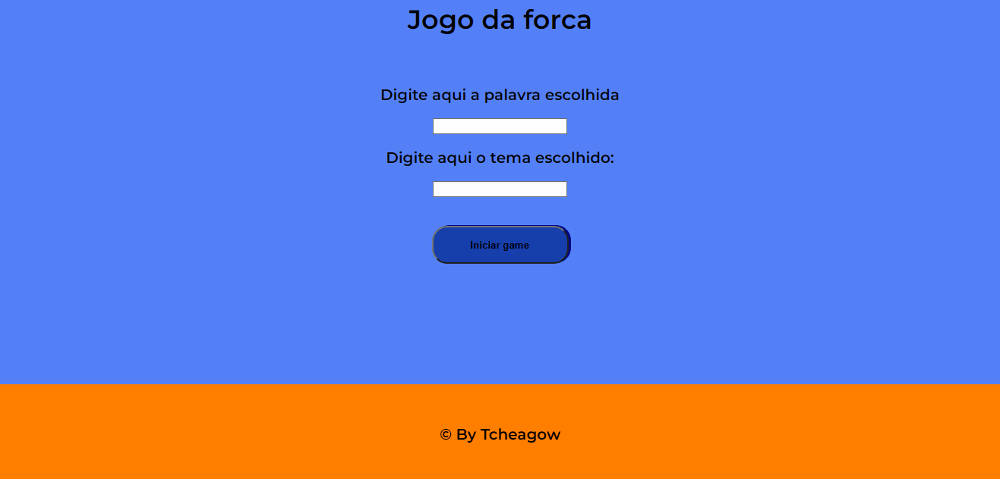

# Jogo da forca
<h1 align="center">
    
</h1>
<h2> Tecnologias:</h2>
<li> HTML</li>
<li> CSS </li>
<li> JavaScript </li>
 
 
<h2> Funcionamento:</h2>

 Não é online. 

O jogo consiste no jogo da forca tradicional. O usuário escolhe uma palavra e digita o tema. O tema irá aparecer como uma dica ao adivinhador e o número de letras da palavra escolhida irá aparecer indiretamente através do número de underlines ( _ ). 

Após a palavra e o tema terem sido escolhidos, o adivinhador tem cinco (5) chanches para advinhar a palavra correta. Ressalta-se que o adivinhador só pode chutar letras. Caso o adivinhador perca as cinco (5) chanches, perde o jogo e caso adivinhe a palavra antes de perder todas as chanches, ganha o jogo

 
<h1> Link do site: </h1>
<a> 
 https://tcheagow.github.io/Jogo-da-forca-HTML-CSS-e-JS/ 
 </a> 
 
 
<h2> Feito por Tcheagow</h2>
